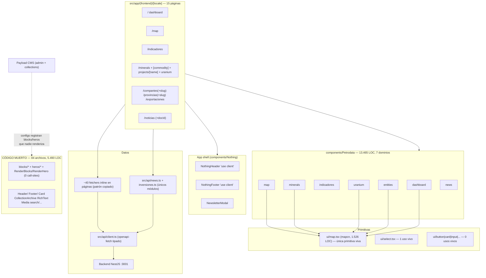
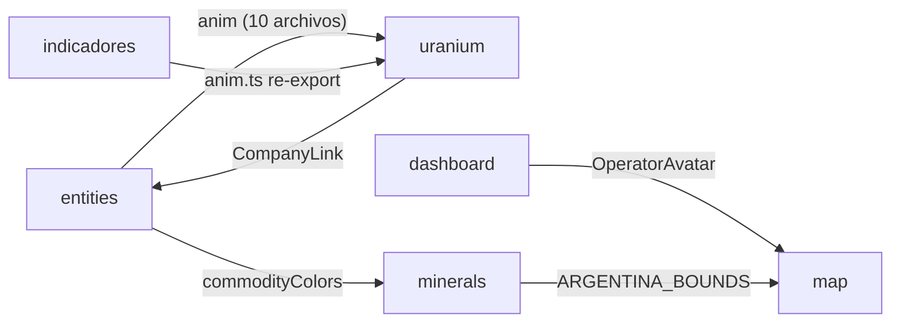

# FRONTEND_AUDIT.md — Auditoría exhaustiva del frontend de Petrodata / vacamuerta.io

> **Repo:** `dylanszejnblum/petrodata` · rama `develop` · commit `8a0a726` (merge PR #75)
> **Fecha de auditoría:** 2026-08-05
> **Alcance:** `frontend/` (Next.js 16 + Payload CMS 3). Backend, data-pipeline y admin de Payload fuera del alcance visual.
> **Método:** análisis estático (grep/conteos reproducibles + análisis de grafo de imports + lectura de código + historial git). **No se ejecutó la app** (requiere Postgres + backend con datos): todo lo marcado ⚠️ requiere verificación en runtime.
> **Documentos hermanos:** [UI_INVENTORY.md](UI_INVENTORY.md) · [DESIGN_SYSTEM_GAP_ANALYSIS.md](DESIGN_SYSTEM_GAP_ANALYSIS.md) · [FRONTEND_TARGET_ARCHITECTURE.md](FRONTEND_TARGET_ARCHITECTURE.md) · [FRONTEND_MIGRATION_ROADMAP.md](FRONTEND_MIGRATION_ROADMAP.md)

---

## 1. Resumen ejecutivo

### Estado general

El frontend es un producto de ~34.600 LOC (281 archivos en `src/`) construido en ~10 semanas por **un solo autor** trabajando con agentes de IA sobre el template oficial `payloadcms/website`. La calidad de implementación de bajo nivel es **notablemente buena** (1 solo `any` explícito en todo el código, `strict: true`, higiene de timers/listeners impecable, i18n de textos con paridad exacta de 665 claves es/en, `prefers-reduced-motion` centralizado en 20 componentes). El problema no es el código línea a línea: es la **ausencia total de capa de sistema**.

Conviven hoy en producción:

- **2 design systems de tokens** (shadcn oklch, muerto en el frontend público, y `--nd-*`, el real) más **paletas de dominio hardcodeadas** en 7 archivos → 5 sistemas de color efectivos.
- **3 lenguajes visuales** por oleadas de rediseño no completadas: "Nothing v1" (mayo: esquinas vivas, hairline grid) en `/map`, `/minerals`, `/uranium`, `/exportaciones`; "vacamuerta-diseno01" (julio: fotos, cards) en `/provincias`, `/indicadores`; "card-style" (agosto: `rounded-[10px]`) en `/` y `/noticias`. Más un cuarto fantasma en el `loading.tsx` (`rounded-[2rem]`, herencia del template).
- **~16% de código muerto** (84 archivos, 5.490 LOC): todo el pipeline de render del template Payload (blocks, heros, RichText, Card, CollectionArchive…) quedó instalado pero desconectado — no existe ninguna ruta `[slug]`/`/posts` que lo renderice. El CMS permite editar contenido que ninguna URL muestra y el live preview está roto.
- **0 primitivas adoptadas**: 45 `<button>` crudos vs 0 usos vivos de `ui/button.tsx`; `ui/card.tsx` con 0 importadores; la escala tipográfica real (label 10–11px uppercase) copiada a mano **174 veces** sin token.

### Causa probable de la fragmentación (respaldada por evidencia)

No es descuido — es **ausencia de memoria escrita**:

1. Los tres documentos de convenciones (`frontend/AGENTS.md`, `frontend/README.md`, `.agents/skills/design-taste-frontend/SKILL.md`) son **boilerplate de terceros con un único commit (`fdd3a46`, 2026-05-30) y cero ediciones en 137 commits**. Ninguno menciona `nd-*`, Schibsted, `components/Petrodata/`, ni una sola convención real del producto.
2. El design kit real (**`vacamuerta-diseno01`**, citado en el commit `9f8804a` y en 3 comentarios de código) **nunca fue versionado en el repo**. La memoria del diseño vive en prompts efímeros.
3. Cada feature llegó como un prompt (`Tickets/*-PROMPT*.md`) **con su propia estética** ("Bloomberg Terminal × Linear" para uranium, editorial fotográfico para provincias, cards para dashboard) sin reconciliación.
4. **No hay CI** (`.github/` no existe): 75+ PRs mergeados sin un solo check; el lint estuvo roto sin que nadie lo notara hasta `54d33cc`. Solo hay 5 tests, 4 de ellos del template sin modificar.

La correlación es medible: adopción del lenguaje visual nuevo vs fecha de último commit por carpeta es un gradiente perfecto (`rounded-*`: dashboard 6 → map/minerals/uranium **0**).

### Riesgos más importantes

| # | Riesgo | Evidencia clave |
|---|--------|-----------------|
| 1 | **Sin manejo de errores**: 0 `error.tsx`, 0 error boundaries, 0 `Suspense`. Backend caído = "no hay datos" o pantalla blanca de Next sin marca. | ver ARQ-05, A11Y hallazgo A6 |
| 2 | **Accesibilidad por debajo de AA**: 7 hallazgos Critical (sin skip link, mapa 100% inaccesible por teclado, foco invisible en ~82 de 91 interactivos, `--nd-text-disabled` a 2.85:1 usado como texto informativo en todo el sitio). | VIS-10..14, A11Y A1–A7 |
| 3 | **Bomba de tiempo tipográfica**: `tailwind.config.mjs` vivo vía `@config` apunta a fuentes que no existen (`--font-space-*`); `font-mono` no es monoespaciada; `font-bold` usa un peso no cargado (synthetic bold). | VIS-01/02 |
| 4 | **Performance sin política**: 12 de 14 rutas `force-dynamic` + `revalidate 0`, N+1 de 20 requests por render en `/minerals`, ~32KB de i18n en cada HTML, `html{opacity:0}` ata el first paint a un script inline. | PERF-01..06 |
| 5 | **Cero red de seguridad**: sin CI, sin visual regression, sin tests de producto → cualquier migración de design system es a ciegas hasta que exista la Fase 0 del roadmap. | TEST-01..04 |

### Impacto sobre velocidad, calidad y escalabilidad

- **Velocidad:** cada feature nueva reinventa tabla, card, chip, formato de números y leyenda de mapa (6 tablas, 11 patrones de card, 14 controles, 5 leyendas, 4 "compact format" — todos sin código compartido). El costo de cada pantalla nueva crece linealmente y el de cada rediseño global es prohibitivo (por eso las 3 olas quedaron incompletas).
- **Calidad:** bugs de producto ya visibles: formateo numérico que ignora el idioma (34 `'es-AR'` + 22 `'en-US'` hardcodeados — `/en/indicadores` muestra `1.234,5`), token `--nd-error` inexistente referenciado en producción, tarjetas negras fijas en modo claro, 404 en inglés bajo `/es`.
- **Escalabilidad:** el modelo por dominio (`components/Petrodata/{sección}`) es correcto y escala; lo que no escala es que las piezas transversales (anim, formatters, CompanyLink, paletas) viven "donde nacieron" y se importan cruzado (`uranium/anim.ts` ← 10 archivos de otros dominios).

### Nivel de urgencia y recomendación general

**Urgencia: media-alta, sin necesidad de reescritura.** La base es buena (tipos, dominio, i18n, motion). La recomendación es una **migración incremental en 6 fases** (ver [roadmap](FRONTEND_MIGRATION_ROADMAP.md)):

1. **Fase 0 (protección)**: CI + visual baselines + `error.tsx` — sin esto, todo lo demás es riesgo ciego.
2. **Fase 1 (fundaciones)**: resolver la dualidad de tokens (formalizar `--nd-*` como sistema único, borrar `tailwind.config.mjs`, arreglar contraste y dark overrides), unificar formatters (bug funcional), borrar el template muerto.
3. **Fases 2–3**: primitivas mínimas (`Surface`, `Button`, `Chip`, `Stat`, `DataTable`, `ChartFrame`, `PetrodataMap`) extraídas de lo que ya existe — no inventadas.
4. **Fases 4–5**: migración por pantalla en orden de retorno y consolidación.

No se recomienda adoptar shadcn "completo" ni reemplazar librerías: Recharts, MapLibre, anime.js y next-intl están bien elegidas y bien usadas donde se usaron con criterio. El design system debe **formalizar el lenguaje "Nothing/nd-\*" que ya ganó de facto**, no imponer uno nuevo.

---

## 2. Mapa del frontend actual

### 2.1 Stack (hechos verificados)

| Capa | Tecnología | Estado |
|------|-----------|--------|
| Framework | Next.js **16.2.3** App Router, React **19.2.4**, TS **5.7.3** (`strict: true`) | central |
| CMS | Payload **3.82.1** embebido (`(payload)/admin`), Postgres | central para noticias/admin; **su pipeline de render frontend está muerto** |
| Estilos | Tailwind **4.1.18** CSS-first (`globals.css`) + `tailwind.config.mjs` legacy vía `@config` | central / **conflicto activo** |
| Primitivas | shadcn parcial (9 archivos en `ui/`, `components.json`) + registry `@mapcn` (`ui/map.tsx`, 1.526 LOC) | solo `ui/map.tsx` y `ui/select.tsx` vivos |
| Datos | `openapi-fetch` + tipos generados (`pnpm api:types` → `src/api/types.ts`, 4.088 LOC) | central, pero capa `src/api/` casi vacía (2 módulos; el resto inline en páginas) |
| Charts | Recharts 3.8 (10 archivos) + SVG a mano (6) + CSS puro (4) | fragmentado |
| Mapas | MapLibre GL 5.22 vía `ui/map.tsx` + 6 wrappers de dominio | central |
| Animación | anime.js 4 (`uranium/anim.ts`) + tw-animate-css + RAF manual + keyframes inline | fragmentado (6 sistemas) |
| i18n | next-intl 4.13, `[locale]` es/en, `localePrefix: 'as-needed'` | central, sano |
| Formularios | react-hook-form (solo en template muerto); producto: 2 inputs a mano | infrautilizado |
| Testing | Vitest + Playwright (5 tests, 4 del template) | nominal |
| Analytics | GA4 (`@next/third-parties`) + MS Clarity (⚠️ CSP no incluye `clarity.ms` → probablemente bloqueado) | activo |
| Sin usar | `geist` (0 imports), `mermaid` (~2MB, solo alcanzable desde admin), `prism-react-renderer`, `@radix-ui/react-checkbox`/`label` (solo template muerto) | sobran |

### 2.2 Arquitectura y capas

**Imports cruzados entre dominios** (unidireccionales, sin ciclos, pero sin capa `shared/`):

### 2.3 Flujo de datos

- **Modelo dominante (correcto):** server components fetchean con `api.GET` tipado y pasan props a componentes cliente presentacionales. Sin Redux/Zustand (innecesario).
- **3 providers:** `Theme` (vivo), `Units` (vivo, gas MMm³/d↔MMcf/d), `HeaderTheme` (**muerto de facto**: solo lo consumen 2 archivos inalcanzables, pero sigue montado en toda la app).
- **Client fetch (3 casos justificados):** `MapExperience` (refetch por viewport con cache LRU manual + debounce + abort — una capa de datos completa dentro de un componente), `CompanyList` (polling 5 min), newsletter (POST).
- **Caching:** 2 de 14 rutas cachean (`/` 300s, `/indicadores` 3600s). El resto `force-dynamic` + `no-store`/`revalidate 0` — herencia literal del README del template (línea 177 recomienda `no-store`). `provincias/[slug]` y `companies/[slug]` tienen la contradicción `force-dynamic` + `next:{revalidate:3600}` en el mismo archivo. Tags declarados (`inversiones`) sin ningún `revalidateTag`.

---

## 3. Catálogo de inconsistencias

> Severidades: **Critical / High / Medium / Low / Informational**. Esfuerzo: S (<1 día), M (1–3 días), L (semana+). Cada hallazgo es rastreable a archivo:línea. Los hallazgos de accesibilidad detallados (42, A1–A42 con SC de WCAG) están al final de esta sección en forma resumida; el detalle completo vive en el informe de a11y integrado en [UI_INVENTORY.md](UI_INVENTORY.md) §screens y aquí en §3.5.

### 3.1 Arquitectura (ARQ)

| ID | Hallazgo | Evidencia | Impacto / Alcance | Sev. | Esf. | Recomendación | Riesgo regresión |
|----|----------|-----------|-------------------|------|------|---------------|------------------|
| ARQ-01 | **84 archivos / 5.490 LOC muertos (16% de src)**: pipeline de render del template Payload completo (`RenderBlocks`/`RenderHero` con 0 call-sites; no existe ruta `[slug]` ni `/posts`) + 891 LOC de Petrodata huérfanos (`StepScene` 605, `ProductionChart`, `dashboard/Sparkline`, `CommodityBreakdownBars`) | `blocks/RenderBlocks.tsx:19`, `heros/RenderHero.tsx:15`, análisis de grafo de imports | Ruido cognitivo en cada búsqueda; el 2º design system (shadcn) vive aquí; arrastra deps (`mermaid` ~2MB, `prism-react-renderer`, `react-hook-form`, 2 pkgs radix) | High | M | Borrar en bloque tras decidir el futuro del CMS (ver Pregunta abierta #3). Conservar: `AdminBar`, `providers/Theme`, `collections/*`, `access/*`, `plugins/*` | Bajo (es inalcanzable), verificar con build |
| ARQ-02 | **CMS editable sin render**: `collections/Pages` y `Posts` registran blocks/heros en el admin, pero los renderers React son inalcanzables. Live preview redirige a rutas 404 (`generatePreviewPath.ts:3-6` → `/posts`, `/{slug}`) | `collections/Pages/index.ts:5-10`, `Posts/index.ts:93`, `next/preview/route.ts:56` | Un editor puede crear contenido que nunca se muestra; `revalidatePath` sobre rutas inexistentes | High | — | Decisión de producto: o se conecta una ruta `[slug]`, o se podan los blocks/heros de las collections | — |
| ARQ-03 | **Módulos transversales viviendo dentro de un dominio**: `uranium/anim.ts` importado por 10 archivos de otros dominios (+ shim `indicadores/anim.ts`); `CompanyLink`, `OperatorAvatar`, `commodityColors` ídem | `entities/EntityTimeline.tsx:4` et al. | Topología engañosa; tres rutas de import para el mismo módulo | Medium | S | Mover a `src/lib/motion.ts` (y `Petrodata/shared/`), dejar shims re-export temporales | Muy bajo (rename mecánico) |
| ARQ-04 | **Capa de datos duplicada ~40 veces**: patrón `try { api.GET; if(error) return fallback } catch { return fallback }` copiado textual; el mismo endpoint reimplementado por página con políticas de cache distintas (`/operators/contribution` ×3, `/companies` ×3) | `page.tsx:58-66`, `companies/page.tsx:34` vs `indicadores/page.tsx:35` | Deriva de comportamiento entre páginas; imposible cambiar política de cache en un lugar | High | M | Capa `src/api/<recurso>.ts` con `safeGet()` + política de cache por recurso (patrón ya existente en `api/news.ts`) | Bajo por endpoint, migración mecánica |
| ARQ-05 | **0 `error.tsx` / 0 error boundaries / 0 `Suspense`** en todo el repo. `noticias/page.tsx:49` es la única página que puede lanzar sin catch → pantalla blanca por defecto de Next. El resto degrada silenciosamente: backend caído es indistinguible de "sin datos" | `find src -name error.tsx` → vacío; `companies/page.tsx:22` | UX y observabilidad: los fallos de backend no se ven ni se loguean | **Critical** | S | `error.tsx` global + por segmento; distinguir "error" de "vacío" en fallbacks; loguear en los `catch {}` | Muy bajo |
| ARQ-06 | **Caching contradictorio**: `force-dynamic`+`revalidate=0` a nivel ruta conviviendo con `next:{revalidate:3600}` a nivel fetch en los mismos archivos; tags declarados nunca purgados | `provincias/[slug]/page.tsx:19-20` vs `:32-64`; `api/inversiones.ts:250` | El Full Route Cache está desactivado donde el Data Cache dice lo contrario; commit `d88af53` dejó el parche a medias | High | S | Quitar `force-dynamic` donde los fetch ya tienen `revalidate`; política escrita por tipo de página | Medio ⚠️ verificar frescura de datos por página |
| ARQ-07 | **N+1 de red**: `/minerals` hace 20 requests a `/projects/{name}` por render, con `no-store` y `force-dynamic` | `minerals/page.tsx:143-149` | Latencia y carga de backend en cada view | High | S–M | Endpoint batch en backend o cache con revalidate; el comentario en `:143` ya reconoce el problema | Bajo |
| ARQ-08 | Formateo/lógica de negocio en la capa de vista: `buildNationalSeries` (proxy top-5 documentado solo en comentario), regex de madurez bilingüe, join por slugificación de strings trayendo todas las companies | `page.tsx:139-181`, `companies/[slug]/page.tsx:42-55`, `minerals/projects/[name]/page.tsx:110-132` | Reglas de negocio no testeables ni compartibles | Medium | M | Extraer a `src/lib/` puro (patrón ya existe: `wellStatus.ts`, `projectMetrics.ts`) | Bajo con tests unitarios previos |
| ARQ-09 | Páginas-monolito: `minerals/projects/[name]/page.tsx` **653 LOC** con 7 componentes locales + 7 parsers; `companies/[slug]` 503; `MapExperience` 519 con cache LRU+debounce+abort embebidos | ver [UI_INVENTORY.md](UI_INVENTORY.md) | 7 primitivas latentes invisibles al resto | Medium | M | Extraer en Fase 2–3 del roadmap | Bajo |
| ARQ-10 | Barrel `components/Nothing/index.ts` nunca importado y desincronizado; convención real = named exports (107 `export function`, sana) | `Nothing/index.ts:1-4` | Informational | Info | S | Borrar el barrel o adoptarlo; documentar la convención | Nulo |
| ARQ-11 | `HeaderThemeProvider` montado en toda la app con solo consumidores muertos | `providers/index.tsx:11-15` | Provider innecesario en el árbol | Low | S | Quitar junto con ARQ-01 | Nulo |

### 3.2 Componentes (COMP) — detalle completo en [UI_INVENTORY.md](UI_INVENTORY.md)

| ID | Hallazgo | Evidencia | Sev. | Esf. | Recomendación |
|----|----------|-----------|------|------|---------------|
| COMP-01 | **0% de adopción de primitivas**: 45 `<button>` crudos vs 5 usos de `ui/Button` (todos en código muerto); consecuencia directa: focus-visible y disabled solo existen en la primitiva que nadie usa | grep `<button` (24 archivos) | **Critical** | M | Reescribir `Button` sobre tokens `nd-*` y migrar (Fase 2) |
| COMP-02 | **6 implementaciones de tabla + 2 leaderboards, 0 código compartido** (ni un helper de sort ni un `<Th>`); `ContributionTable` y `OperatorLeaderboard` comparten bloque de animación carácter por carácter | tabla comparativa en UI_INVENTORY §2.3 | High | L | `DataTable` (base: contrato de `SortableProjectsTable`) + `ProportionBarList` |
| COMP-03 | **11 patrones de card en 6 familias visuales** donde el producto necesita ~2 (superficie normal + flotante); radios contradictorios (`10px` vs sharp) por sección; 10 implementaciones del par label+valor | UI_INVENTORY §2.4 | High | L | `Surface` + `Stat` (Fase 2) |
| COMP-04 | **Duplicados literales**: `Sparkline` ×2 (delta: cómo se genera el gradientId), `SectionHead(er)` ×3, `MetaRow` ×3, `LegendDot` ×2, `num()` guard ×4, 5 leyendas de mapa, boilerplate MapLibre (`transformRequest`+`CARTO_FONTS_PREFIX`) ×6 | UI_INVENTORY §2 | High | M | Consolidar según matriz de duplicación (no fusionar `anim.ts`: es re-export sano, solo reubicar) |
| COMP-05 | **14 controles clickeables ad hoc** (chips, segmented, badges) que colapsan en 3 primitivas; el más reutilizable (`Segmented` de `FilterPanel.tsx:235`) es privado | UI_INVENTORY §1.2 | High | M | `Chip/Badge` + `SegmentedControl` (promover el existente) |
| COMP-06 | **20 componentes de chart en 3 tecnologías sin abstracción**: config de ejes/grid/tooltip repetida idéntica en 6 archivos; 6 tooltips custom con 4 declaraciones distintas del mismo tipo; `useMounted()` repetido en 9 | UI_INVENTORY §2.8 | High | M | `ChartFrame` + `ChartTooltip`; el `AXIS` de `MacroChart.tsx:50` ya es el borrador |
| COMP-07 | **Formateo fragmentado — bug funcional de i18n**: 4 implementaciones de "compact", 46 call-sites de `Intl`/`toLocaleString` con 3 políticas de locale (12 `es-AR` fijo, 6 `en-US` fijo, 8 ternarios copiados, 2 sin locale); 5 implementaciones de fecha | UI_INVENTORY §2.10 | **Critical** (visible en `/en`) | M | `src/lib/format.ts` + `useFormatters()` locale-aware; migración mecánica |
| COMP-08 | **2 contadores animados**: `AnimatedCounter` (RAF propio, sin reduced-motion, SSR renderiza "0" — en el `<h1>` del home) duplica `animateCounter` de `anim.ts` (que sí respeta reduced-motion) | `AnimatedCounter.tsx:61-83`, `page.tsx:301-312` | High | S | Borrar `AnimatedCounter`, usar `animateCounter` + SSR con valor final |
| COMP-09 | 2 donuts (Recharts vs SVG a mano): mismo patrón visual, la versión SVG (`StatusDonut`) es superior (reduced-motion, N segmentos) | UI_INVENTORY §2.9 | Medium | M | Promover `StatusDonut` a `Donut` |
| COMP-10 | Bug menor: `UraniumStats.tsx:41` `gridTemplateColumns: cond ? undefined : undefined` (ambas ramas iguales, fix incompleto) | `uranium/UraniumStats.tsx:41` | Low | S | Completar o borrar |

### 3.3 Visual / tokens (VIS) — detalle completo en [DESIGN_SYSTEM_GAP_ANALYSIS.md](DESIGN_SYSTEM_GAP_ANALYSIS.md)

| ID | Hallazgo | Evidencia | Sev. | Esf. | Recomendación |
|----|----------|-----------|------|------|---------------|
| VIS-01 | **`tailwind.config.mjs` vivo (`@config` en `globals.css:4`) apunta a fuentes inexistentes** (`--font-space-grotesk/mono` no definidas en ningún lado); `geist` instalado sin usar; comentarios refieren a "Doto" que tampoco existe | `tailwind.config.mjs:5-9` vs `globals.css:53-55` | **Critical** (riesgo sistémico ante upgrade de Tailwind) ⚠️ precedencia no verificada en runtime | S | Migrar `typography` del config a CSS y borrar `@config`; desinstalar `geist` |
| VIS-02 | **Tokens tipográficos que mienten**: `--font-mono` = Schibsted Grotesk (sans, no mono) con `letter-spacing .03em` + `tabular-nums` forzados globalmente (466 usos de `font-mono`); `--font-sans` ≡ `--font-display` = Helvetica Neue (ausente en Win/Linux → Arial para gran parte del tráfico); `font-bold` (6 usos) = synthetic bold (700 no cargado) | `globals.css:53-55,224-227`, `layout.tsx:25-30` | High | S–M | Renombrar roles (`font-technical`/`font-editorial`), decidir carga real de display, cargar 700 o prohibir `font-bold` |
| VIS-03 | **Escala tipográfica arbitraria domina**: 412 `text-[Npx]` (56%) vs 241 nombrados; 18 valores incl. medios píxeles; el rol "label técnico" (`text-[10px] font-mono uppercase tracking-[0.08em]`) copiado **174 veces** con 7 trackings distintos para el mismo gesto; ~10 recetas distintas de `h1` | conteos DS_GAP §2 | High | M | Tokenizar `type.label.{sm,md}`, `type.kpi`, `type.h1` etc. y migrar |
| VIS-04 | **Radius sin decisión**: token `--radius` usado solo en `ui/*` muerto (11% de usos); el radio real del producto (`10px`, 30 usos) no es token; 3 carpetas usan sharp 0px deliberado (comentado en `uranium/theme.ts:3`) — dos identidades de esquina en producción | DS_GAP §4.1 | High | S (decisión) + M (migración) | Decidir `radius.card` (10px o 0) — pregunta abierta #2 — y tokenizar |
| VIS-05 | **5 sistemas de color**: ratio `nd-*` : shadcn = 11,9:1; 142 hex hardcodeados (47 distintos); duplicados exactos (`#d4a843`==`--nd-warning` hardcodeado 4× con comentario que lo admite; tema Mermaid = réplica manual del dark `nd-*`); `clusterColors` triplicado literal; `OIL_COLOR`/`GAS_COLOR` con 2 valores distintos entre páginas hermanas | DS_GAP §1 | High | M | Consolidar sobre `nd-*`; paletas de dominio como tokens `chart.*`/`commodity.*` |
| VIS-06 | **`--nd-error` no existe y se usa** → color inválido en runtime en el hero de uranio (todo movimiento a la baja) | `uranium/UraniumHero.tsx:30` | High (bug visible) | S (1 línea) | Definir `--nd-error` (y su dark) |
| VIS-07 | **Subsistema "foto oscura" ignora theming**: `bg-[#16191d]` ±variantes en 7 archivos, invariante a `data-theme` (tarjetas negras en modo claro), con 12 alfas de `text-white` y 14 alfas de scrim sin escala | DS_GAP §1.4 | High | M | Tokens `surface.photo` + `scrim.{soft,mid,hard}` + `text.on-media.*` |
| VIS-08 | **4 tokens `nd-*` sin override dark** (`accent`, `accent-subtle`, `success`, `warning`): `#d71921` sobre negro = 3.64:1 | `globals.css:137-147` | High | S | Añadir overrides dark |
| VIS-09 | `--nd-black` invertido semánticamente (light=#f5f5f5); `--nd-text-primary` (23 usos) redundante con `--nd-text-display` (188) | `globals.css:98,105-106` | Medium | S | Renombrar a `canvas`; deprecar `text-primary` |
| VIS-10 | **Contraste — fallos AA sistémicos**: `--nd-text-disabled` (264 usos, **como texto informativo**: nav no activa, labels de KPI, cabeceras de tabla) = 2.85:1 claro / 3.29:1 oscuro, casi siempre a 9–11px; `--nd-warning` texto = 2.21:1; `#f5f5f5` sobre success = 3.04:1; bordes 1.22:1 como único delimitador de inputs/chips | cálculos en UI_INVENTORY §3.11 | **Critical** | M | Re-derivar los 3 tokens (subir disabled a ≥ #767676, warning a tono más oscuro, border-visible ≥3:1 para controles) — **cambio visual global, requiere baseline previo** |
| VIS-11 | **Motion: 6 sistemas, escala inexistente** (18 duraciones JS distintas 0–9000ms, 4 vocabularios de easing); 5 animadores sin `prefers-reduced-motion` (`AnimatedCounter`, keyframes de Header y NewsletterModal, 2 `animate-ping` infinitos) — en contraste con `anim.ts` que lo hace perfecto en 20 componentes | DS_GAP §5 | Medium | M | Tokens `motion.duration/ease` + consolidar sobre `anim.ts` |
| VIS-12 | Iconografía: 28 iconos lucide con 3 notaciones de tamaño (`size-4` / `h-4 w-4` / `size={16}`), `Search` y `SearchIcon` importados como 2 nombres, 15 strokeWidth distintos, 11 SVG inline duplicables por lucide | DS_GAP §6 | Low | S–M | Convención única (`size-*`), `icon.stroke` token |
| VIS-13 | Breakpoint `2xl: 86rem` no estándar con **0 usos** (solo corta `.container` en 1376px) y contradice `cssVariables.js` (1536) que rige el `srcset` de imágenes — dos tablas de breakpoints | `globals.css:51` vs `cssVariables.js:6` | Medium | S | Unificar (borrar `cssVariables.js`, derivar de `@theme`) |
| VIS-14 | `@apply border-border` sobre `*` inyecta el token **shadcn** en componentes `nd-*`: un `border` sin color explícito sale del sistema equivocado | `globals.css:216` | Medium | S | Apuntar el default a `--nd-border` |
| VIS-15 | Sombras sin sistema: diseño plano (borde 1px, 721 usos consistentes — bien) contradicho por 1 sombra propietaria con 2 alfas + glows hex-concatenados (`${color}99`) en 13 lugares | DS_GAP §4.3 | Low | S | `elevation.overlay` único |

### 3.4 Responsive (RESP)

| ID | Hallazgo | Evidencia | Sev. | Esf. | Recomendación |
|----|----------|-----------|------|------|---------------|
| RESP-01 | **Cobertura desigual y correlacionada con la época**: `companies/[slug]` 46 clases responsive (la mejor) vs `map/` 3 clases en 10 archivos, `dashboard/` 6/8, `news/` 8/10; `map/page.tsx` **0** | conteos por carpeta en UI_INVENTORY §3 | High | L | Presupuesto responsive por pantalla en Fase 4 |
| RESP-02 | **Bug funcional móvil**: `fitBounds` con `padding {left:336, right:336}` (paneles desktop) aplicado también en móvil (viewport 375px) → zoom incorrecto al filtrar ⚠️ verificar en dispositivo | `MapExperience.tsx:250-254` | High | S | Padding condicional por viewport |
| RESP-03 | `ContributionTable` **oculta 4 de 7 columnas** en móvil sin aviso ni alternativa (pérdida de datos); mejor patrón disponible en el mismo repo: `ProjectsTable` colapsa a lista con labels inline | `ContributionTable.tsx:115-127` vs `ProjectsTable.tsx:35,113` | Medium | M | Adoptar el patrón colapso-a-lista en `DataTable` |
| RESP-04 | Anchos fijos en overlays de mapa (`w-[20rem]`, `w-[18rem]` vs `maxWidth 22rem`) y leyendas `absolute` sin guarda `md:` que tapan el mapa chico | `WellPopup.tsx:161`, `UraniumMap.tsx:202`, `EntityMap.tsx:56` | Medium | S | `w-[min(90vw,20rem)]` (patrón ya usado en `NewsFilters.tsx:143`) |
| RESP-05 | **6 touch targets < 24px (WCAG 2.5.8)** adyacentes entre sí: chips de filtro ~19–22px, reset del FilterPanel ~12px, switches 16–20px | UI_INVENTORY §2.6 | High | S–M | `min-h` en primitivas `Chip`/`Button` (resuelto de fábrica al migrar) |
| RESP-06 | Doble render desktop+móvil en `MapExperience` (4 componentes instanciados 2 veces); positivo: mobile-first genuino sin un solo `max-*` en el repo | `MapExperience.tsx:407,439` | Low | M | Aceptable a corto plazo; documentar |

### 3.5 Accesibilidad (A11Y) — resumen de los 42 hallazgos (7 Critical, 11 High)

Los Critical, todos verificables por código:

| ID | Hallazgo | WCAG | Evidencia |
|----|----------|------|-----------|
| A11Y-01 | Sin skip link; ~10–12 tabs de header repetidos por página; ningún `<main>` con destino de foco | 2.4.1 | global |
| A11Y-02 | `/map` 100% inaccesible: datos solo en canvas WebGL, popups solo por click de mouse, sin tabla alternativa, **y sin ningún heading** | 1.1.1, 2.1.1, 2.4.6 | `MapExperience.tsx:372,390` |
| A11Y-03 | Foco invisible en ~82 de 91 interactivos (93 `hover:` vs 9 `focus-visible:`); 2 casos con `outline-none` sin reemplazo perceptible | 2.4.7, 1.4.11 | `CompanyList.tsx:100`, `Header.tsx:248` |
| A11Y-04 | Contraste: ver VIS-10 (es el mismo hallazgo raíz — se arregla en tokens) | 1.4.3, 1.4.11 | `globals.css:97-170` |
| A11Y-05 | Sin `error.tsx` (= ARQ-05): errores sin marca, sin idioma, sin recuperación | 3.3.1 | global |
| A11Y-06 | `html{opacity:0}` revertido solo por script inline: JS bloqueado = sitio invisible con el contenido en el DOM | robustez | `globals.css:230-237` |
| A11Y-07 | 3 modales portalizados sin focus trap / foco inicial / restauración; menú móvil además sin `role=dialog` ni Escape | 2.4.3, 2.4.11, 2.1.2 | `Header.tsx:269-337`, `SettingsControl.tsx:56` |

High (síntesis): 12 charts Recharts sin `accessibilityLayer` ni alternativa textual; 3 inputs con placeholder como única etiqueta; errores de formulario sin `role=alert` y éxito sin anuncio (con pérdida de foco); `<label>` envolviendo `role=switch` → switch sin nombre; 6 wrappers de tabla `overflow-x-auto` sin `tabIndex={0}` (columnas inalcanzables por teclado); touch targets (RESP-05); `<h1>` del home = contador animado (SSR emite "0"). Medium/Low: live regions faltantes (10 casos) y una conducida por scroll (`ProcessScrolly`), 404 y strings del menú móvil en inglés bajo `[locale]`, radiogroup sin roving tabindex, `title=` como único acceso a texto truncado (19 casos), `alt` redundantes (2).

**Lo que ya está bien (proteger):** `<html lang>` dinámico; h1 en 15/16 páginas con `<h2>` semánticos en `SectionLabel`; 0 divs clickeables en 91 interactivos; 0 tabindex positivos; alt text 14/14 correcto; `aria-sort`/`aria-pressed`/`role=switch` donde se usaron; **`StockPriceChart.tsx` es el componente accesible modelo** (aria-busy, role=status, sr-only live region, focus-visible, min-h-11) — usarlo como referencia interna; reduced-motion centralizado.

### 3.6 Performance (PERF) — medido vs inferido

| ID | Hallazgo | Medido/Inferido | Sev. | Esf. | Recomendación |
|----|----------|-----------------|------|------|---------------|
| PERF-01 | 12/14 rutas `force-dynamic`; 0 `Suspense`, 0 `generateStaticParams` → sin streaming, todo SSR caliente contra la API; waterfalls de 2 saltos en `/` y `/map` | Medido (código) | High | M | Extender el patrón del commit `f80b375` (el único `perf:`, excelente) al resto; Suspense en secciones lentas |
| PERF-02 | Recharts estático en 8 archivos vivos (entra al first-load de `/`, `/indicadores`, `/provincias/[slug]`); `/minerals/uranium` = ruta más pesada (recharts + animejs + ~2.500 LOC client estáticos). MapLibre en cambio **bien resuelto** (lazy en las 7 rutas + preconnect) | Inferido (sin build) ⚠️ | Medium | M | `next/dynamic` para charts below-the-fold |
| PERF-03 | ~32KB de mensajes i18n serializados en **cada** HTML (`NextIntlClientProvider` sin `pick()`) | Medido (bytes) | Medium | M | Namespaces selectivos por layout/página |
| PERF-04 | `html{opacity:0}` ata FCP/LCP al script inline de tema (+ A11Y-06) | Inferido ⚠️ | High | S | Sustituir por estrategia de `color-scheme`/clase en SSR (cookie o media query default) |
| PERF-05 | Imágenes: `images.qualities:[100]` en `next.config.ts:28` con call-sites usando el default 75 (⚠️ verificar con build: 400 o quality 100 forzada); `favicon.png` **134KB** renderizado a 24px en el footer de todas las páginas; fotos de provincia 212–546KB; logos vía favicons de Google en runtime con 21 logos locales sin usar | Medido (bytes) + inferido | Medium | S–M | Corregir config, optimizar favicon, unificar sistema de logos |
| PERF-06 | Video reel del home: 10 clips ~2,9MB con `preload="auto"` rotando cada 6,5s (sí respeta reduced-motion, sí va lazy) | Medido | Low | S | `preload="metadata"` + poster |
| PERF-07 | `AnimatedCounter` sin reserva de ancho en el `<h1>` → CLS real durante 1,6s | Inferido ⚠️ | Medium | S | Se resuelve con COMP-08 + `min-width`/`ch` |
| PERF-08 | `/map` serializa FeatureCollection de 1000 pozos en el RSC payload sin caché | Inferido ⚠️ | Medium | M | Cache con revalidate corto o fetch client inicial |
| PERF-09 | Positivo (proteger): charts con altura reservada 31/31 (`useMounted` + contenedor fijo → 0 CLS de charts); `next/font` correcto; `mermaid` NO entra en bundles públicos (solo peso de instalación) | Medido | Info | — | — |

### 3.7 Testing (TEST)

| ID | Hallazgo | Sev. | Recomendación |
|----|----------|------|---------------|
| TEST-01 | **5 tests totales; 4 son del template sin modificar**; el único del producto verifica que la home tiene `<h1>`. `@testing-library/react` instalado, 0 tests de componente (y `vitest.config.mts` ni los incluiría) | Critical | Pirámide propuesta en §Fase 0 del roadmap |
| TEST-02 | **CI inexistente** (`.github/` no existe): 75+ PRs sin checks; lint estuvo roto sin detección; e2e corren contra `pnpm dev` (no build) y requieren backend+DB vivos sin mocks; `admin.e2e` escribe en la DB | Critical | GitHub Actions: typecheck+lint+build+tests como gate mínimo |
| TEST-03 | Sin visual regression, sin axe, sin Lighthouse/bundle budget, sin contract testing del OpenAPI | High | Playwright `toHaveScreenshot` + `@axe-core/playwright` en Fase 0 |
| TEST-04 | Funciones puras de negocio sin tests (formatters, `buildChartRows`, `wellStatus`, `projectMetrics`, conversión de unidades de gas — estado global que afecta cifras en toda la app); bug de navegación arreglado en `d88af53` sin test de regresión | High | Vitest sobre `src/lib/` — el retorno más alto por hora invertida |

**Pirámide de testing propuesta** (adecuada a este proyecto: data-viz + SSR, un solo dev):
1. **Base — unit (Vitest):** formatters, units, wellStatus, projectMetrics, buildChartRows, slugify, paridad de claves i18n. Barato, sin infra.
2. **Media — component (Vitest+RTL):** primitivas del DS a medida que nazcan (Button, Chip, Stat, DataTable: sort/empty/a11y attrs).
3. **Media-alta — e2e smoke (Playwright + MSW o backend seed):** 1 test por ruta (render + h1 + sin errores de consola), flujo de filtros del mapa, cambio de idioma, cambio de unidades.
4. **Cima — visual regression (Playwright screenshots):** 1 captura por página × 2 temas × 2 viewports = baseline de la migración. **Esta capa es prerequisito del design system, no un nice-to-have.**

### 3.8 Developer experience (DX)

| ID | Hallazgo | Sev. | Recomendación |
|----|----------|------|---------------|
| DX-01 | **Documentación interna 100% boilerplate**: `AGENTS.md` (Payload genérico), `README.md` (template intacto, con consejo de caching que causó ARQ-06), `SKILL.md` (skill anti-slop que se autoexcluye de dashboards); ninguno menciona el producto. El design kit real nunca fue committeado | Critical (causa raíz) | Reescribir `AGENTS.md` con las convenciones reales; versionar el design kit (ver roadmap Fase 0) |
| DX-02 | ESLint degrada `no-explicit-any`/`no-unused-vars` a `warn` → `pnpm lint` pasa con violaciones; `api/types.ts` generado no está en ignores de eslint/prettier | Medium | Endurecer en CI; añadir ignores |
| DX-03 | Tickets con rutas absolutas de la máquina del autor, nombres de ruta desactualizados, sin estado done; 17/17 son features (0 de deuda/perf/a11y) | Low | Proceso: tickets versionados con criterios de aceptación del DS |
| DX-04 | `tsconfig` sin `noUncheckedIndexedAccess` (el flag ausente más relevante para este código de arrays); `skipLibCheck: true` | Low | Evaluar activarlo en una PR dedicada |
| DX-05 | `next-sitemap.config.cjs` con `exclude:['/*']` (excluye todo) y sitemaps fantasma, conviviendo con el `sitemap.ts` real | Low | Borrar next-sitemap del postbuild |

### 3.9 Design system readiness (DSR)

| ID | Hallazgo | Sev. |
|----|----------|------|
| DSR-01 | No existe fuente de verdad visual versionada (el "design kit" vive fuera del repo) — decisión previa a cualquier token | Critical |
| DSR-02 | El lenguaje ganador de facto es `nd-*`/"Nothing" (1.157 usos vs 97): el DS debe formalizarlo, no reemplazarlo | Informational |
| DSR-03 | Ya existen 5 embriones de DS para promover: `SectionLabel` (autodeclarado "Design-system section rule"), `Segmented` (FilterPanel), `OverlayCard`, `wellStatus.ts` ("single source of truth"), `anim.ts` | Informational |
| DSR-04 | Sin Storybook ni entorno de desarrollo aislado de componentes | High |

---

## 4. Quick wins (bajo riesgo, alto impacto — ejecutables antes del design system)

| # | Acción | Arregla | Esf. | Riesgo |
|---|--------|---------|------|--------|
| 1 | Definir `--nd-error` (+ dark) en `globals.css` | VIS-06 (bug visible) | 1 línea | Nulo |
| 2 | `error.tsx` global + por segmento con shell y traducción | ARQ-05/A11Y-05 | horas | Nulo |
| 3 | Skip link + `id`/`tabIndex={-1}` en `<main>` + `tabIndex={0}` en los 6 wrappers de tabla | A11Y-01, A17 | horas | Nulo |
| 4 | Clase utilitaria `.nd-focus` (`focus-visible:outline-2 outline-nd-interactive`) aplicada a los ~82 interactivos sin foco | A11Y-03 | 1 día | Muy bajo |
| 5 | Overrides dark de `--nd-accent/success/warning/accent-subtle` | VIS-08 | minutos | Bajo (revisar charts) |
| 6 | `src/lib/format.ts` + migrar los 46 call-sites de Intl | COMP-07 (bug i18n) | 2–3 días | Bajo, mecánico |
| 7 | Quitar `force-dynamic` de `provincias/[slug]` y `companies/[slug]` (los fetch ya tienen revalidate 3600) | ARQ-06 | minutos | Medio ⚠️ validar frescura |
| 8 | Optimizar `favicon.png` (134KB→<5KB) y corregir `images.qualities` | PERF-05 | horas | Nulo |
| 9 | Borrar los 4 huérfanos Petrodata (StepScene, ProductionChart, dashboard/Sparkline, CommodityBreakdownBars) + `NewsSponsors` comentado | ARQ-01 parcial | horas | Nulo (verificar build) |
| 10 | Traducir `not-found.tsx` y los 2 aria-label del menú móvil; mensajes de error del newsletter a i18n | A26, fugas i18n | horas | Nulo |
| 11 | `aria-label` al switch de `FilterPanel:191` y a la búsqueda de `CompanyList:94`; `role=alert` en errores del newsletter | A10/A11/A16 | horas | Nulo |
| 12 | Reemplazar "Backend offline at {url}" por mensaje de usuario sin URL interna | A22 + fuga de infra | minutos | Nulo |
| 13 | CI mínimo: typecheck + lint + build en GitHub Actions | TEST-02 | 1 día | Nulo |
| 14 | Fix `fitBounds` móvil (padding condicional) | RESP-02 | horas | Bajo ⚠️ probar |

---

## 5. Matriz de priorización

| Cuadrante | Contenido |
|-----------|-----------|
| **Quick wins** (impacto alto, esfuerzo bajo) | Los 14 de la tabla §4. Total estimado: ~2 semanas de trabajo de una persona. |
| **Strategic foundations** (impacto alto, esfuerzo medio, urgencia media) | Fase 0 completa (CI + visual baseline + pirámide de tests base); consolidación de tokens (`DESIGN_SYSTEM_GAP_ANALYSIS`); `AGENTS.md` real + design kit versionado; capa `src/api/` unificada; borrado del template muerto (decisión CMS mediante). |
| **High-risk migrations** (impacto alto, esfuerzo alto, requieren baseline previo) | Re-derivación de tokens de contraste (VIS-10 — cambia el aspecto de todo el sitio); migración de 45 botones a `Button`; consolidación de 6 tablas en `DataTable`; unificación de radius (decisión de identidad); accesibilidad del mapa (alternativa tabular). |
| **Optional improvements** | Suspense/streaming generalizado; `pick()` de i18n; virtualización (no hay evidencia de listas suficientemente largas — **no optimizar prematuramente**); Storybook completo (empezar con una página `/dev/ds` interna puede bastar); `noUncheckedIndexedAccess`. |

---

## 6. Preguntas abiertas (requieren decisión humana de negocio/producto/diseño)

1. **¿La referencia visual es el estado actual de `/` y `/noticias` (ola "card-style", agosto)?** Asumimos que sí. Si existe `vacamuerta-diseno01` (Figma/mockups), hay que versionarlo en el repo — es la fuente de verdad que falta.
2. **Identidad de esquinas: ¿`10px` (dashboard/news) o sharp (map/minerals/uranium)?** Hoy conviven como dos identidades. La migración de `Surface` necesita esta decisión el día 1.
3. **¿Qué futuro tiene el CMS de Pages/Posts?** Los blocks/heros del admin no se renderizan en ningún lado. Opciones: (a) podar las collections y borrar ~3.400 LOC; (b) conectar una ruta `[slug]` real. Cambia el alcance del borrado de ARQ-01.
4. **¿`/minerals`, `/minerals/uranium` y `/exportaciones` siguen siendo producto?** Están fuera del nav desde el pivot a O&G (`8f71381`), congeladas desde mayo, pero indexables a propósito. Si son secundarias, van al final del roadmap; si vuelven al foco, suben.
5. **¿Prioridad mobile real?** El producto es desktop-denso pero `/map` (pantalla central) casi no tiene adaptación. ¿Hay datos de tráfico móvil que justifiquen la inversión de la Fase 4?
6. **¿Compromiso formal con WCAG 2.2 AA?** Los fallos de contraste se arreglan en tokens pero **cambian el aspecto del sitio** (grises más oscuros). Necesita el OK de diseño.
7. **¿Navegadores/soporte objetivo?** Asumimos evergreen. Afecta la decisión de `Helvetica Neue` (ausente fuera de macOS/iOS) y de `color-mix()`/`oklch`.
8. **¿Hay fecha objetivo o evento (lanzamiento, demo) que ordene el roadmap?**

---

## 7. Áreas no verificadas (límites de esta auditoría)

- **Nada se ejecutó**: sin build (`next build` no corrido — los tamaños de bundle por ruta son inferencias), sin runtime (precedencia real `@config` vs `@theme`, comportamiento de `images.qualities`, Clarity vs CSP), sin dispositivos (fitBounds móvil, zoom 400%, lectores de pantalla — los 8 ítems [MAN] listados en UI_INVENTORY).
- **Contraste sobre overlays translúcidos** (`bg-nd-surface/85` sobre tiles de mapa) es impredecible estáticamente.
- **Datos reales**: volúmenes de listas (¿cuántas companies/proyectos? — afecta si virtualizar), tráfico por ruta, Core Web Vitals de campo.
- **Figma/design kit externo**: no accesible desde el repo.
