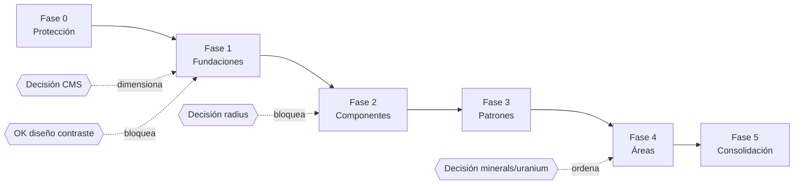

# FRONTEND_MIGRATION_ROADMAP.md — Roadmap de migración progresiva

> Restricción principal: **conservar el comportamiento del producto**. Cada fase termina verificable. Referencias: [FRONTEND_AUDIT.md](FRONTEND_AUDIT.md) (IDs de hallazgos), [DESIGN_SYSTEM_GAP_ANALYSIS.md](DESIGN_SYSTEM_GAP_ANALYSIS.md) (tokens/APIs), [FRONTEND_TARGET_ARCHITECTURE.md](FRONTEND_TARGET_ARCHITECTURE.md) (objetivo).
> Estimaciones para 1 dev (+agentes IA). Las fases 0–2 son secuenciales; 3–5 admiten solapamiento.

---

## Fase 0 — Protección (≈1 semana) · SIN CAMBIOS VISUALES

**Objetivo:** que ningún cambio posterior pueda romper el producto sin ser detectado.

| Ítem | Detalle |
|---|---|
| CI | GitHub Actions: typecheck + lint (reglas subidas a error) + `next build` + vitest + playwright. Hoy: 0 CI (TEST-02) |
| Visual baseline | Playwright `toHaveScreenshot`: 15 páginas × 2 temas × 2 viewports contra build con datos seed/MSW |
| Tests base | unit de `formatNumber`, `units`, `wellStatus`, `projectMetrics`, `buildChartRows` + paridad de claves i18n + smoke e2e por ruta |
| Resiliencia | `error.tsx` global y por segmento (quick win #2) — es protección, no feature |
| Métricas | bundle size por ruta (`next build` output archivado en CI) + Lighthouse CI en `/`, `/map`, `/indicadores` como referencia |
| Reglas anti-deuda | desde ya: PRs nuevas no agregan hex, ni `text-[Npx]`, ni botones sin focus-visible (lint warn→error al cerrar Fase 1) |
| Memoria escrita | reescribir `AGENTS.md` + versionar el design kit en `docs/design/` (DX-01/DSR-01 — la causa raíz) |

**Dependencias:** ninguna. **Riesgos:** e2e requieren backend seed o MSW (elegir MSW si el seed es caro). **Criterio de finalización:** CI en verde obligatorio para merge; baseline visual commiteada. **Resultado:** red de seguridad completa.

---

## Fase 1 — Fundaciones (≈2 semanas)

**Objetivo:** una sola fuente de tokens, tipografía sana, formatters únicos, código muerto fuera.

**Alcance:**
1. `styles/tokens.css` con las 3 capas ([DS_GAP §5](DESIGN_SYSTEM_GAP_ANALYSIS.md)); alias `--nd-*` → semánticos para no tocar 1.157 call-sites aún.
2. Fixes de tokens: `--nd-error` (VIS-06), overrides dark (VIS-08), rename `nd-black`→canvas (VIS-09), `border-border`→nd (VIS-14), scrims 3 pasos (VIS-07 parcial).
3. **Contraste** (VIS-10/A11Y-04): re-derivar `text.tertiary`, `status.caution`, `status.positive`, `border.interactive` — ⚠️ cambio visual global, validar contra baseline + OK de diseño (pregunta abierta #6).
4. Tipografía: borrar `@config`/`tailwind.config.mjs` (portando `typography` a CSS), desinstalar `geist`, decidir display real, cargar 700 o prohibir `font-bold`, tokens `type.label.*` (VIS-01/02/03).
5. `src/lib/format.ts` + migración de los 46 call-sites (COMP-07 — bug i18n) y `lib/motion.ts` (ex `uranium/anim`, con shims) (ARQ-03).
6. Borrado del muerto (ARQ-01): huérfanos Petrodata + template render pipeline según decisión CMS (pregunta abierta #3) + `HeaderTheme` + deps sobrantes (`mermaid` si se poda el CMS, `prism-react-renderer`, radix muertos).
7. A11y foundations: skip link, `.nd-focus` utility en interactivos, `tabIndex` en wrappers de tabla, theming sin `opacity:0` (A11Y-01/03/06; quick wins #3/4).
8. Caching: quitar los `force-dynamic` contradictorios y documentar política por recurso (ARQ-06, quick win #7).

**Dependencias:** Fase 0 completa (el punto 3 es indefendible sin baseline). **Riesgos:** precedencia `@config` (verificar build tras borrarlo ⚠️); frescura de datos al tocar caching; el cambio de contraste es el de mayor riesgo visual de todo el roadmap — hacerlo en PR aislada. **Criterio:** 0 hex nuevos posibles (lint en error), formatters únicos, `pnpm build` sin template muerto, baseline re-aprobada. **Resultado:** el suelo sobre el que se construyen los componentes.

---

## Fase 2 — Componentes esenciales (≈3 semanas)

**Objetivo:** primitivas extraídas de lo existente (no inventadas), adoptadas primero en las pantallas de referencia.

**Alcance** (APIs en [DS_GAP §6](DESIGN_SYSTEM_GAP_ANALYSIS.md)):

| Primitiva | Origen (promover, no inventar) | Absorbe |
|---|---|---|
| `Surface` | familia B (dashboard, ola 3) + `OverlayCard` | 11 patrones de card (COMP-03) — **requiere decisión de radius (pregunta #2)** |
| `Button` | esqueleto CVA de `ui/button` sobre tokens nd | 45 botones crudos (COMP-01) |
| `Chip`/`Badge` | `SourceChip` + `DeltaChip` | 9 chips/badges ad hoc (COMP-05) |
| `SegmentedControl` | `Segmented<T>` de FilterPanel | 4 segmented inline |
| `Stat` | `StatCounters` (semántica `<dl>`) + `animateCounter` | 10 label+valor + `AnimatedCounter` (COMP-08: fija SSR-"0", reduced-motion, CLS del h1) |
| `Skeleton` + `loading.tsx` ×3 formas | placeholder actual | 6 copias + skeleton global equivocado |
| `EmptyState` | `StockPriceEmpty` | 5 markups + 8 `return null` silenciosos |
| `SectionLabel` | ya existe | 3 clones locales |
| `Sparkline`, `Donut` | dashboard/Sparkline (API) + StatusDonut | 2+2 duplicados (COMP-04/09) |
| `Dialog` (Radix) | patrón de `ui/select` | NewsletterModal, SettingsControl, menú móvil (A11Y-07) |
| `Input`+`Field` | mínimo viable | 2 inputs sin label (A10/A11) |
| `PageHero` | hero copiado ×3 | listados |

Adopción piloto en este orden: **`/` → `/indicadores`** (juntas ejercitan Surface, Stat, Chip, SegmentedControl, Skeleton, charts). Instalar `/dev/ds` con todo × 2 temas y sumarla al visual testing.

**Dependencias:** Fase 1. **Riesgos:** regresiones visuales sutiles al unificar paddings/radios (mitigadas por baseline); tentación de "mejorar" mientras se migra — prohibida, una PR = una consolidación. **Criterio:** las 2 pantallas piloto sin `<button>` crudo, sin card ad hoc, sin `text-[Npx]`; `/dev/ds` en CI. **Resultado:** design system v0 real y probado en producción.

---

## Fase 3 — Patrones complejos (≈3 semanas)

**Objetivo:** los patrones que hoy tienen 6 implementaciones.

- `DataTable` + `ProportionBarList` (COMP-02; incluye el fix de columnas ocultas de ContributionTable → colapso a lista, y `tabIndex`/`scope`/`aria-sort` de serie).
- `ChartFrame` + `ChartTooltip` (COMP-06) + `accessibilityLayer`/resumen textual (A12); dynamic import de charts below-the-fold (PERF-02).
- `PetrodataMap` + `MapLegend` únicos (COMP-04 mapas); fix `fitBounds` móvil (RESP-02); alternativa accesible mínima de `/map`: heading + tabla de pozos visibles (A11Y-02).
- Navegación: menú móvil sobre `Dialog` (focus trap + Escape + restauración); `Pager` desde NewsPager.
- Forms: newsletter sobre `Field` (labels, `role=alert`, live region de éxito).
- Capa de datos `src/api/` por recurso + `safeGet` con logging + `Suspense` en las páginas multi-fetch (ARQ-04/05, PERF-01); N+1 de minerals (ARQ-07, coordinar endpoint batch con backend).
- Page layouts: templates listado/detalle/mapa.

**Dependencias:** Fase 2. **Riesgos:** DataTable es la migración con más superficie de comportamiento (sort/filtros) — test de componente antes de migrar cada tabla; tocar `/map` requiere pruebas manuales móviles ([MAN] list). **Criterio:** 0 implementaciones paralelas de tabla/leyenda/tooltip fuera del DS; axe sin Critical en páginas migradas. **Resultado:** todos los patrones estructurales tienen una sola implementación.

---

## Fase 4 — Migración por áreas (≈3–4 semanas, priorizada por impacto/riesgo/reuso)

| Orden | Área | Justificación | Riesgo |
|---|---|---|---|
| 1 | `/minerals/projects/[name]` | 653 LOC, 7 primitivas locales → mecánico post-Fase 2/3, máximo retorno | Bajo |
| 2 | `/map` completa | producto central, congelada desde julio, peor a11y/responsive | Alto (manual testing) |
| 3 | `/companies/[slug]` + `/provincias/[slug]` | fichas con tablas/stats ya cubiertos; extraer lógica de negocio a `lib/` (ARQ-08) | Medio |
| 4 | Listados (`/companies`, `/provincias`, `/exportaciones`) | mecánico con `PageHero` + `DataTable` | Bajo |
| 5 | `/noticias` (+docId) | try/catch faltante ya cubierto por error.tsx; cards→Surface | Bajo |
| 6 | `/minerals` + `[commodity]` | depende de decisión de producto (pregunta #4); des-duplicar 60% entre ambas | Medio |
| 7 | `/minerals/uranium` | **último**: internamente consistente, estética propia (decidir si el sub-tema teal/amber se formaliza como theme del DS o se normaliza) | Medio |

Cada pantalla migrada cierra con: estados completos, responsive presupuestado (RESP-01), a11y checklist, capturas nuevas al baseline.

**Criterio:** todas las rutas consumen DS; grep de hex/`text-[Npx]`/`<button` crudo = 0 fuera de `ui/`+`tokens.css`. **Resultado:** un solo lenguaje visual en producción.

---

## Fase 5 — Consolidación (≈1 semana + continuo)

- Borrar shims (`anim.ts` re-exports, alias `--nd-*` si se decide renombrar), componentes deprecados y `cssVariables.js`; `pnpm dedupe` + limpieza final de deps.
- Documentación final: AGENTS.md actualizado con el estado post-migración; ADRs de las decisiones tomadas; CHANGELOG del DS.
- Enforcement definitivo: lint anti-hex/anti-arbitrarios en **error**; boundaries en error; axe y visual como gates permanentes.
- Métricas posteriores vs Fase 0: bundle por ruta, Lighthouse, conteo de tokens fuera de sistema (objetivo 0), LOC muertas (objetivo 0).
- Revisión trimestral: lista [MAN] de a11y + auditoría grep de deriva (script en CI que cuenta arbitrarios nuevos).

**Criterio de éxito global** (el de la auditoría): una persona nueva entiende el frontend desde los docs, sabe qué reusar/consolidar/deprecar, y el sistema **no puede** volver a fragmentarse sin que el CI lo señale.

---

## Resumen de dependencias

**Total estimado:** ~12–14 semanas de esfuerzo neto de 1 dev con agentes, paralelizable parcialmente con trabajo de features a partir de la Fase 2 (las features nuevas ya nacen sobre el DS, lo que amortiza la migración).
